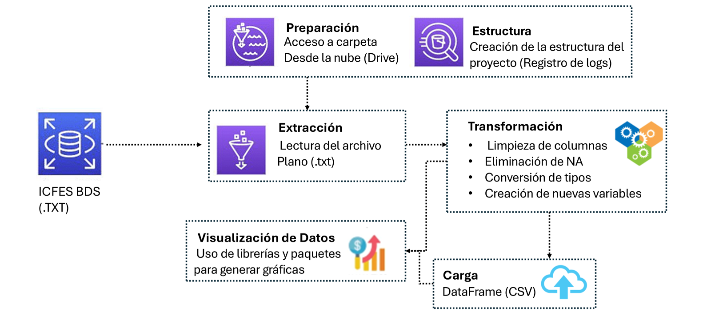

# Procesamiento Inteligente para el Análisis Educativo en Colombia (Saber Pro-11)

Este proyecto corresponde a la aplicación de distintos conocimientos adquiridos en la materia de **ETL (Extract, Transform, Load)** utilizando Python y sus librerías orientadas al análisis y procesamiento de datos. El objetivo principal es realizar la limpieza, transformación y carga de un conjunto de datos relacionados con los resultados de las pruebas **Saber Pro – 11** en Colombia.

---

## Objetivo

Aplicar un proceso ETL para preparar datos de los resultados de las pruebas Saber Pro-11 con el fin de dejarlos listos para análisis posteriores. Esto incluye:

- Detección y corrección de valores nulos  
- Transformación de tipos de datos  
- Creación de nuevas variables  
- Exportación del resultado limpio

---

### Tecnologías y Herramientas

<br />

[](https://www.python.org/)  
[](https://pandas.pydata.org/)  
[](https://numpy.org/)  
[](https://matplotlib.org/)  
[](https://seaborn.pydata.org/)  
  
[](https://jupyter.org/)  
[](https://colab.research.google.com/)

---

## Estructura del proceso ETL

### 1. **Extracción de datos**
Se carga un archivo `.TXT` con los resultados de las pruebas Saber Pro-11 (por ejemplo: `SB11_20232.TXT`), que se convierte a un DataFrame.

### 2. **Transformación de datos**
- Limpieza de columnas y nombres  
- Conversión de fechas  
- Manejo de valores nulos  
- Creación de nuevas columnas  
- Validaciones y estandarización de formatos  
- Análisis exploratorio (opcional)

### 3. **Carga de datos**
- Exportación del dataset limpio a un archivo `.csv`

---

## ⚙️ ETL Pipeline: Descripción General

Este pipeline automatiza el proceso **ETL** (Extracción, Transformación y Carga), permitiendo una gestión eficiente de los datos desde su origen hasta su almacenamiento final en un formato listo para análisis.

La función `run_etl()` actúa como el **orquestador principal del flujo de trabajo**.



---

## Funcionalidades del Pipeline

1. **Creación de estructura de carpetas**  
   - `create_project_structure()` genera carpetas para datos crudos, transformados, logs y otros archivos auxiliares.

2. **Configuración del sistema de logging**  
   - `setup_logging()` permite el monitoreo del pipeline y la detección de errores.

3. **Extracción de datos**  
   - `extract_data()` accede al archivo fuente y lo convierte a un DataFrame.

4. **Transformación de los datos**  
   - `transform_data(df_raw)` limpia y estandariza los datos para su análisis.

5. **Carga de datos transformados**  
   - `load_data()` exporta el resultado final a `.csv` en la carpeta definida.

6. **(Opcional) Análisis exploratorio**  
   - Se puede añadir análisis exploratorio como parte del pipeline o en una etapa posterior.

---

## Ejecución del Pipeline

Para correr todo el flujo ETL, simplemente ejecuta:

```python
run_etl()
```

---

## Autores

- Juan Felipe Hernández  
- Manuel Enrique Luna Alegría  
- Dallys Nicol Sinisterra Gutiérrez
